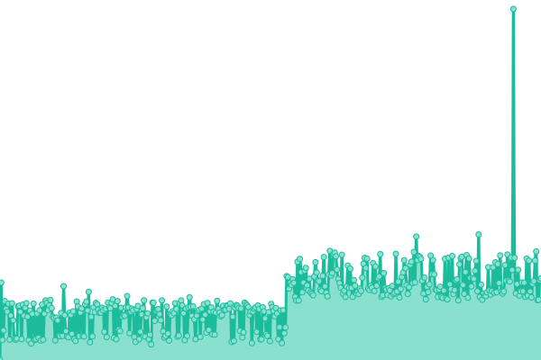
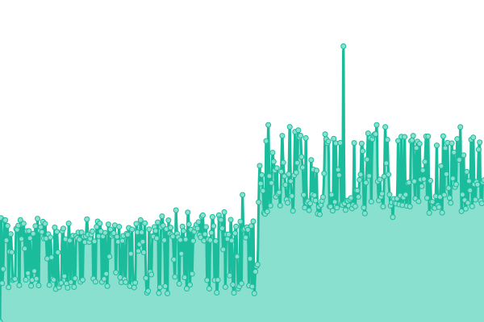

# [📈 Live Status](https://SRESchool.github.io/AllMyhospitalnow-monitor-upptime): <!--live status--> **🟧 Partial outage**

This repository contains the open-source uptime monitor and status page for [SRESchool](https://SRESchool.github.io/AllMyhospitalnow-monitor-upptime), powered by [Upptime](https://github.com/upptime/upptime).

With [Upptime](https://upptime.js.org), you can get your own unlimited and free uptime monitor and status page, powered entirely by a GitHub repository. We use [Issues](https://github.com/SRESchool/AllMyhospitalnow-monitor-upptime/issues) as incident reports, [Actions](https://github.com/SRESchool/AllMyhospitalnow-monitor-upptime/actions) as uptime monitors, and [Pages](https://SRESchool.github.io/AllMyhospitalnow-monitor-upptime) for the status page.

<!--start: status pages-->
<!-- This summary is generated by Upptime (https://github.com/upptime/upptime) -->
<!-- Do not edit this manually, your changes will be overwritten -->
<!-- prettier-ignore -->
| URL | Status | History | Response Time | Uptime |
| --- | ------ | ------- | ------------- | ------ |
|  [AskDoctorLive](https://askdoctorlive.com) | 🟩 Up | [ask-doctor-live.yml](https://github.com/SRESchool/AllMyhospitalnow-monitor-upptime/commits/HEAD/history/ask-doctor-live.yml) | 

 879ms
     
 | 

<a href="https://SRESchool.github.io/AllMyhospitalnow-monitor-upptime/history/ask-doctor-live">35.72%</a>
    

|  [BestCardiacHospitals](https://bestcardiachospitals.com) | 🟩 Up | [best-cardiac-hospitals.yml](https://github.com/SRESchool/AllMyhospitalnow-monitor-upptime/commits/HEAD/history/best-cardiac-hospitals.yml) | 

 708ms
     
 | 

<a href="https://SRESchool.github.io/AllMyhospitalnow-monitor-upptime/history/best-cardiac-hospitals">35.72%</a>
    

|  [BestCosmeticHospitals](https://bestcosmetichospitals.com) | 🟩 Up | [best-cosmetic-hospitals.yml](https://github.com/SRESchool/AllMyhospitalnow-monitor-upptime/commits/HEAD/history/best-cosmetic-hospitals.yml) | 

 787ms
     
 | 

<a href="https://SRESchool.github.io/AllMyhospitalnow-monitor-upptime/history/best-cosmetic-hospitals">35.72%</a>
    

|  [BestDentalHospitals](https://bestdentalhospitals.com) | 🟩 Up | [best-dental-hospitals.yml](https://github.com/SRESchool/AllMyhospitalnow-monitor-upptime/commits/HEAD/history/best-dental-hospitals.yml) | 

 774ms
     
 | 

<a href="https://SRESchool.github.io/AllMyhospitalnow-monitor-upptime/history/best-dental-hospitals">35.72%</a>
    

|  [BestEyeHospitals](https://besteyehospitals.com) | 🟩 Up | [best-eye-hospitals.yml](https://github.com/SRESchool/AllMyhospitalnow-monitor-upptime/commits/HEAD/history/best-eye-hospitals.yml) | 

 559ms
     
 | 

<a href="https://SRESchool.github.io/AllMyhospitalnow-monitor-upptime/history/best-eye-hospitals">0.00%</a>
    

|  [BestHeartSurgery](https://bestheartsurgery.com) | 🟩 Up | [best-heart-surgery.yml](https://github.com/SRESchool/AllMyhospitalnow-monitor-upptime/commits/HEAD/history/best-heart-surgery.yml) | 

 837ms
     
 | 

<a href="https://SRESchool.github.io/AllMyhospitalnow-monitor-upptime/history/best-heart-surgery">35.72%</a>
    

|  [BestSpineHospitals](https://bestspinehospitals.com) | 🟩 Up | [best-spine-hospitals.yml](https://github.com/SRESchool/AllMyhospitalnow-monitor-upptime/commits/HEAD/history/best-spine-hospitals.yml) | 

 698ms
     
 | 

<a href="https://SRESchool.github.io/AllMyhospitalnow-monitor-upptime/history/best-spine-hospitals">35.72%</a>
    

|  [CancersHospitals](https://cancershospitals.com) | 🟩 Up | [cancers-hospitals.yml](https://github.com/SRESchool/AllMyhospitalnow-monitor-upptime/commits/HEAD/history/cancers-hospitals.yml) | 

 689ms
     
 | 

<a href="https://SRESchool.github.io/AllMyhospitalnow-monitor-upptime/history/cancers-hospitals">35.72%</a>
    

|  [HeartCareForYou](https://heartcareforyou.in) | 🟩 Up | [heart-care-for-you.yml](https://github.com/SRESchool/AllMyhospitalnow-monitor-upptime/commits/HEAD/history/heart-care-for-you.yml) | 

 353ms
     
 | 

<a href="https://SRESchool.github.io/AllMyhospitalnow-monitor-upptime/history/heart-care-for-you">0.00%</a>
    

|  [HipHospitals](https://hiphospitals.com) | 🟩 Up | [hip-hospitals.yml](https://github.com/SRESchool/AllMyhospitalnow-monitor-upptime/commits/HEAD/history/hip-hospitals.yml) | 

 655ms
     
 | 

<a href="https://SRESchool.github.io/AllMyhospitalnow-monitor-upptime/history/hip-hospitals">70.30%</a>
    

|  [KneeHospitals](https://kneehospitals.com) | 🟩 Up | [knee-hospitals.yml](https://github.com/SRESchool/AllMyhospitalnow-monitor-upptime/commits/HEAD/history/knee-hospitals.yml) | 

 755ms
     
 | 

<a href="https://SRESchool.github.io/AllMyhospitalnow-monitor-upptime/history/knee-hospitals">35.72%</a>
    

|  [MyHospitalNow](https://myhospitalnow.com) | 🟥 Down | [my-hospital-now.yml](https://github.com/SRESchool/AllMyhospitalnow-monitor-upptime/commits/HEAD/history/my-hospital-now.yml) | 

 0ms
     
 | 

<a href="https://SRESchool.github.io/AllMyhospitalnow-monitor-upptime/history/my-hospital-now">0.00%</a>
    

|  [MyMedicPlus](https://mymedicplus.com) | 🟩 Up | [my-medic-plus.yml](https://github.com/SRESchool/AllMyhospitalnow-monitor-upptime/commits/HEAD/history/my-medic-plus.yml) | 

 713ms
     
 | 

<a href="https://SRESchool.github.io/AllMyhospitalnow-monitor-upptime/history/my-medic-plus">20.26%</a>
    

|  [SurgeryPlanet](https://surgeryplanet.com) | 🟥 Down | [surgery-planet.yml](https://github.com/SRESchool/AllMyhospitalnow-monitor-upptime/commits/HEAD/history/surgery-planet.yml) | 

 0ms
     
 | 

<a href="https://SRESchool.github.io/AllMyhospitalnow-monitor-upptime/history/surgery-planet">0.00%</a>
    

<!--end: status pages-->

[**Visit our status website →**](https://SRESchool.github.io/AllMyhospitalnow-monitor-upptime)

## 📄 License

- Powered by: [Upptime](https://github.com/upptime/upptime)
- Code: [MIT](./LICENSE) © [Anand Chowdhary](https://anandchowdhary.com), supported by [Pabio](https://pabio.com)
- Data in the `./history` directory: [Open Database License](https://opendatacommons.org/licenses/odbl/1-0/)
